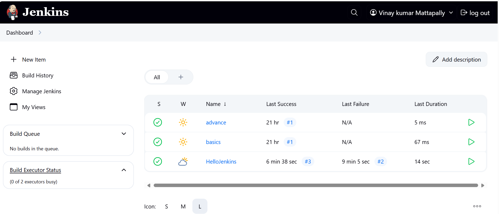

## INITIAL STAGE VIEW
Shows execution of the first three stages: Build, Test, and Deploy

## INITIAL CONSOLE OUTPUT 
Logs showing each step before the "Cleanup" stage was added

## STAGE VIEW AFTER CLEANUP
Illustrates successful execution of the new Cleanup stage along with the previous ones

## CONSOLE VIEW AFTER CLEANUP
Confirms execution of the new Cleanup stage via echo and sleep commands

## JENKINS DASHBOARD
Displays available jobs, build queue, and executor status

